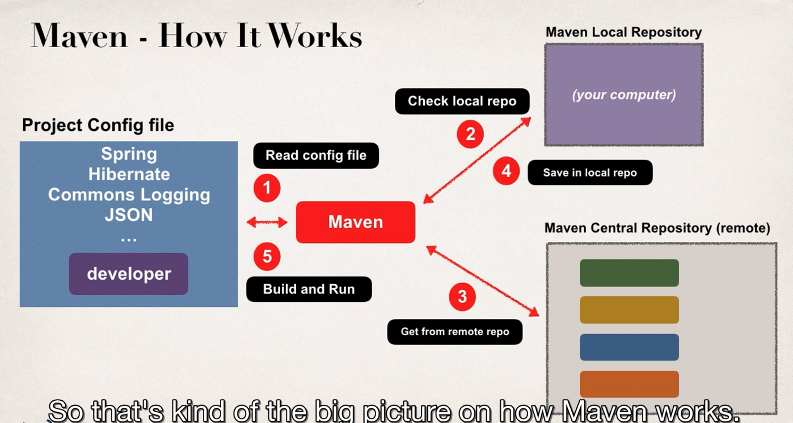

What is Maven ? 

* Maven is a project management Tool.
* Most Popular use of maven is for build management and dependecies

Project without Maven ? 

Maven will go our and download the JAR files for the project for you.

And maven will make those JAR file available during compile and run time (Personal shopper)

Project with Maven.

Building and Running 

When you build and run your project

Maven will handle class / build path for you 

Based on config file, Maven will add JAR files accordingly
